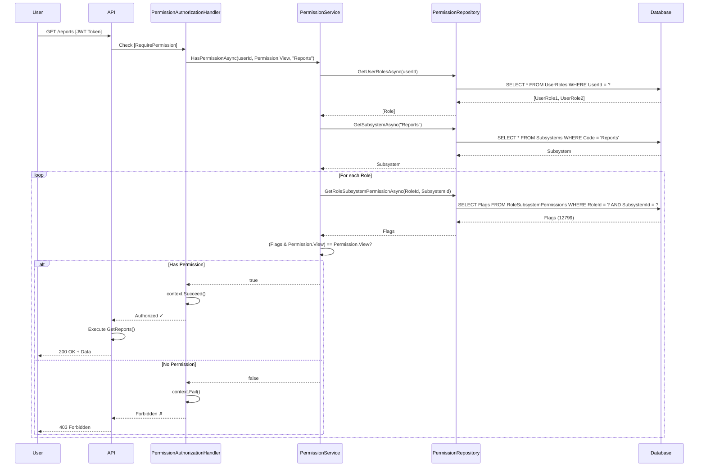

# RBAC System - Chi Tiết Kiến Trúc & Luồng Phân Quyền

## 📊 Tổng Quan 2 Cách Phân Quyền

Hệ thống của bạn có **2 cách phân quyền song song**:

### ✅ Cách 1: Module-based (Cũ - Hiện đang dùng trong PermissionSeeder)
```
PermissionSeeder.cs (seed dữ liệu)
    ↓
RolePermission (Role + Module + Flags)
    ↓
UserPermissionOverride (UserId + Module + Flags)
    ↓
PermissionService → HasPermissionAsync()
    ↓
PermissionAuthorizationHandler (kiểm tra [RequirePermission])
```

**Dùng:** `nameof(PermissionModule.Users)`, `UserPermissions.All`, v.v.

### ✅ Cách 2: Subsystem-based (Mới - SQL Script)
```
Subsystem (Reports, Users, Analytics, Settings, Audit)
    ↓
Role (Admin, Manager, Editor, Viewer)
    ↓
UserRole (many-to-many: User ← → Role)
    ↓
RoleSubsystemPermission (Role + Subsystem + Flags)
    ↓
PermissionService → GetEffectiveFlagsAsync()
```

**Dùng:** `Subsystem.WellKnown.Reports`, `Permission` enum, v.v.

---

## 🏗️ Kiến Trúc Chi Tiết

### 1️⃣ **Entity Relationships**

```
User (1) ← → (many) UserRole
                        ↓
                    (many) ← (1) Role
                                    ↓
                    (many) RoleSubsystemPermission
                                    ↓
                                Subsystem (1)
```

**Database Tables:**
```sql
Users (Legacy - sử dụng hiện tại)
RolePermissions (Legacy)
UserPermissionOverrides (Legacy)

--- New RBAC Tables ---
Subsystems
    - Id (UUID)
    - Code (string, unique)
    - Name, Description
    - IsActive

Roles
    - Id (UUID)
    - Code (string, unique)
    - Name, Description
    - IsActive

UserRoles (Junction)
    - UserId (FK → Users)
    - RoleId (FK → Roles)
    - AssignedAt, ExpiresAt

RoleSubsystemPermissions
    - RoleId (FK → Roles)
    - SubsystemId (FK → Subsystems)
    - Flags (BIGINT - bitwise permissions)
    - UpdatedAt
```

---

## 📁 Danh Sách File & Vai Trò

### **Domain Layer (Entity Definitions)**

| File | Vai trò | Ghi chú |
|------|--------|--------|
| `Domain/Entities/User.cs` | User model | Đã có, dùng hiện tại |
| `Domain/Entities/Role.cs` | **NEW** Role entity | Thay thế enum `Role`, hỗ trợ many-to-many |
| `Domain/Entities/Subsystem.cs` | **NEW** Subsystem entity | Định nghĩa subsystems (Reports, Users, v.v.) |
| `Domain/Entities/UserRole.cs` | **NEW** Junction table | Liên kết User ↔ Role |
| `Domain/Entities/RoleSubsystemPermission.cs` | **NEW** Permission mapping | Gán quyền Role → Subsystem + Flags |
| `Domain/Entities/RolePermission.cs` | **LEGACY** | Cũ: Module-based permissions |
| `Domain/Entities/UserPermissionOverride.cs` | **LEGACY** | Cũ: User-specific overrides |

### **Domain Enums**

| File | Vai trò | Ghi chú |
|------|--------|--------|
| `Domain/Enums/Permission.cs` | **Main enum** | 64-bit flags cho permissions (View=1, Create=2, Edit=4, v.v.) |
| `Domain/Enums/UserPermissions.cs` | **LEGACY** | Module-specific (Users module): Create, Read, Update, Delete, Export |
| `Domain/Enums/OrderPermissions.cs` | **LEGACY** | Module-specific (Orders module): Create, Read, Update, Delete, Approve, Cancel |
| `Domain/Enums/PermissionModule.cs` | **LEGACY** | Module names: Users, Orders, Settings |
| `Domain/Enums/Role.cs` | **LEGACY** | Cũ: enum Role { Admin, User } |

### **Infrastructure - Repository Layer**

| File | Vai trò | Ghi chú |
|------|--------|--------|
| `Infrastructure/Persistence/Repositories/PermissionRepository.cs` | Query permissions | GetByRoleAsync(), GetByUserIdAsync(), GetEffectiveFlagsAsync() |
| `Infrastructure/Persistence/Repositories/RoleRepository.cs` | Query roles | **NEW** GetRoleByCodeAsync(), GetUserRolesAsync() |
| `Infrastructure/Persistence/Repositories/SubsystemRepository.cs` | Query subsystems | **NEW** GetSubsystemByCodeAsync() |

### **Infrastructure - Configurations (EF Mappings)**

| File | Vai trò | Ghi chú |
|------|--------|--------|
| `Infrastructure/Persistence/Configurations/RolePermissionConfiguration.cs` | **LEGACY** Config | Composite key (Role, Module) |
| `Infrastructure/Persistence/Configurations/UserPermissionOverrideConfiguration.cs` | **LEGACY** Config | Composite key (UserId, Module) |
| `Infrastructure/Persistence/Configurations/RoleConfiguration.cs` | **NEW** Config | HasKey(r => r.Id), HasIndex on Code |
| `Infrastructure/Persistence/Configurations/SubsystemConfiguration.cs` | **NEW** Config | HasKey(s => s.Id), HasIndex on Code |
| `Infrastructure/Persistence/Configurations/RoleSubsystemPermissionConfiguration.cs` | **NEW** Config | Composite key (RoleId, SubsystemId) |
| `Infrastructure/Persistence/Configurations/UserRoleConfiguration.cs` | **NEW** Config | Composite key (UserId, RoleId), FK constraints |

### **Application - Services**

| File | Vai trò | Ghi chú |
|------|--------|--------|
| `Application/Permissions/PermissionService.cs` | **Core Service** | HasPermissionAsync(), GetAllEffectiveAsync(), RequirePermissionAsync() |
| `Application/Permissions/IPermissionService.cs` | Interface | Define permission check contracts |
| `Application/Permissions/Services/UserContextService.cs` | **NEW** | GetUserContextAsync() - lấy user's roles & permissions |
| `Application/Permissions/Helpers/PermissionChecker.cs` | Helper | Utility methods for checking permissions |
| `Application/Permissions/Interfaces/IRoleManagementService.cs` | **NEW** | AssignRoleAsync(), RevokeRoleAsync(), UpdateRolePermissionsAsync() |

### **Infrastructure - Services**

| File | Vai trò | Ghi chú |
|------|--------|--------|
| `Infrastructure/Permissions/RoleManagementService.cs` | **NEW** Impl | Implement IRoleManagementService |

### **API Layer**

| File | Vai trò | Ghi chú |
|------|--------|--------|
| `Api/Authorization/PermissionAuthorizationHandler.cs` | **Auth Handler** | Kiểm tra [RequirePermission] attribute |
| `Api/Authorization/PermissionPolicyProvider.cs` | **Policy Provider** | Tạo dynamic policies từ permissions |
| `Api/Authorization/RequirePermissionAttribute.cs` | **Attribute** | `[RequirePermission(Permission.View, "Reports")]` |
| `Api/Authorization/PermissionRequirement.cs` | **Requirement** | IAuthorizationRequirement impl |
| `Api/Controllers/PermissionsController.cs` | **Endpoint** | CRUD permissions, assign roles, v.v. |

### **Seeding**

| File | Vai trò | Ghi chú |
|------|--------|--------|
| `Infrastructure/Persistence/Seed/PermissionSeeder.cs` | **LEGACY Seed** | Seed RolePermissions (cách cũ) |
| `database/setup_permission_tables.sql` | **NEW Seed** | SQL script seed Subsystems, Roles, RoleSubsystemPermissions |

---

## 🔄 Luồng Xác Thực Quyền (Permission Check Flow)

### **Scenario: User truy cập endpoint**

```
1. User gửi Request + JWT Token
        ↓
2. AuthController.AuthorizeAsync() kiểm tra token hợp lệ
        ↓
3. API Endpoint có [Authorize] + [RequirePermission(Permission.View, "Reports")]
        ↓
4. PermissionAuthorizationHandler.HandleAsync() được gọi
        ↓
5. Lấy Current User từ HttpContext.User
        ↓
6. Gọi PermissionService.HasPermissionAsync()
        ├─ Lấy user's UserRoles
        ├─ Lấy Role của user
        ├─ Tìm Subsystem từ "Reports"
        ├─ Lấy RoleSubsystemPermission (RoleId, SubsystemId)
        ├─ Lấy Flags từ RoleSubsystemPermission
        ├─ Kiểm tra: (Flags & Permission.View) == Permission.View ?
        └─ Trả về bool
        ↓
7. Nếu true: Cho phép request tiếp tục
   Nếu false: Trả 403 Forbidden
```

### **Code Flow:**

```csharp
// 1. Endpoint gọi
[HttpGet("reports")]
[Authorize]
[RequirePermission(Permission.View, "Reports")]
public async Task<IActionResult> GetReports()
{
    // Code chạy ở đây nếu authorized
}

// 2. Handler kiểm tra
public class PermissionAuthorizationHandler : AuthorizationHandler<PermissionRequirement>
{
    protected override async Task HandleRequirementAsync(
        AuthorizationHandlerContext context,
        PermissionRequirement requirement)
    {
        // Lấy user ID
        var userId = context.User.FindFirst(ClaimTypes.NameIdentifier)?.Value;
        
        // Gọi permission service
        bool hasPermission = await _permissionService.HasPermissionAsync(
            userId, 
            requirement.Permission, 
            requirement.Subsystem);
        
        if (hasPermission)
            context.Succeed(requirement);
        else
            context.Fail();
    }
}

// 3. Service kiểm tra
public async Task<bool> HasPermissionAsync(Guid userId, Permission permission, string subsystem)
{
    // Lấy roles của user
    var userRoles = await _unitOfWork.Roles.GetUserRolesAsync(userId);
    
    foreach (var role in userRoles)
    {
        // Lấy subsystem
        var subsystemEntity = await _unitOfWork.Subsystems
            .FindAsync(s => s.Code == subsystem);
        
        // Lấy permission flags
        var roleSubsystemPerm = await _unitOfWork.Permissions
            .GetAsync(r => r.RoleId == role.Id && r.SubsystemId == subsystemEntity.Id);
        
        // Kiểm tra bitwise: (Flags & permission) == permission
        if (((Permission)roleSubsystemPerm.Flags).HasPermission(permission))
            return true;
    }
    
    return false;
}
```

---

## 🔐 Permission Flags - Bitwise Operations

### **Giải thích Bitwise:**

```
Permission enum (64-bit):
View        = 1 << 0  = 0000_0001 = 1
Create      = 1 << 1  = 0000_0010 = 2
Edit        = 1 << 2  = 0000_0100 = 4
Delete      = 1 << 3  = 0000_1000 = 8
Export      = 1 << 4  = 0001_0000 = 16
Approve     = 1 << 5  = 0010_0000 = 32
Execute     = 1 << 6  = 0100_0000 = 64
Audit       = 1 << 7  = 1000_0000 = 128
...
```

### **Example: Admin Role**

```
RoleSubsystemPermission:
  RoleId = Admin
  SubsystemId = Reports
  Flags = 12799 (binary: 0011_0001_1111_1111)

Biểu diễn: View | Create | Edit | Delete | Export | Approve | Execute | Audit | ManageUsers | ...
Tức là: Admin có TẤT CẢ quyền trên Reports subsystem
```

### **Kiểm tra Quyền:**

```csharp
// Kiểm tra user có quyền View không
Flags = 12799  (Admin - all permissions)
Permission = View = 1

(Flags & Permission) == Permission
(12799 & 1) == 1
1 == 1  ✓ TRUE → Có quyền

---

// Kiểm tra user (Viewer) có quyền Delete không
Flags = 1  (Viewer - view only)
Permission = Delete = 8

(Flags & Permission) == Permission
(1 & 8) == 8
0 == 8  ✗ FALSE → Không có quyền
```

---

## 📋 Default Permission Seed (SQL Script)

### **Subsystems:**
```sql
Reports      -- Báo cáo & dashboards
Users        -- Quản lý user
Analytics    -- Phân tích nâng cao
Settings     -- Cấu hình hệ thống
Audit        -- Kiểm tra và ghi log
```

### **Roles:**
```sql
Admin    (Code: 'Admin')    -- Full access
Manager  (Code: 'Manager')  -- Department management
Editor   (Code: 'Editor')   -- Content creation
Viewer   (Code: 'Viewer')   -- Read-only
```

### **Role Permissions (RoleSubsystemPermission):**

| Role | Subsystem | Flags | Meaning |
|------|-----------|-------|---------|
| Admin | Reports | 12799 | All permissions (View \| Create \| Edit \| Delete \| Export \| Approve \| Execute \| Audit \| ManageUsers) |
| Admin | Users | 12799 | All permissions |
| Admin | Analytics | 12799 | All permissions |
| Admin | Settings | 12799 | All permissions |
| Admin | Audit | 12799 | All permissions |
| Manager | Reports | 295 | View \| Create \| Edit \| Approve \| ManageUsers |
| Manager | Users | 295 | View \| Create \| Edit \| Approve \| ManageUsers |
| Manager | Analytics | 1 | View only |
| Manager | Audit | - | No access |
| Editor | Reports | 7 | View \| Create \| Edit |
| Editor | Users | 1 | View only |
| Editor | Analytics | - | No access |
| Viewer | Reports | 1 | View only |
| Viewer | Analytics | 1 | View only |
| Viewer | Others | - | No access |

---

## 📊 Mermaid Flow Diagram

### **Full Permission Check Flow:**



---

## 🎯 So Sánh 2 Cách

| Tiêu chí | Module-based (Cũ) | Subsystem-based (Mới) |
|---------|-----|------|
| **Entity** | RolePermission | RoleSubsystemPermission + Role + UserRole |
| **Role** | Enum (Admin, User) | Entity with many-to-many support |
| **Module** | String nameof() | Subsystem entity + Code |
| **User-Role** | Implicit (enum) | Explicit (UserRole junction) |
| **Permission** | Module-specific enum (UserPermissions, OrderPermissions) | Unified Permission enum (64-bit) |
| **Scalability** | Khó thêm module mới | Dễ thêm subsystem mới |
| **User Override** | Có (UserPermissionOverride) | Có thể thêm UserSubsystemPermissionOverride |
| **Role Expiry** | Không | Có (UserRole.ExpiresAt) |
| **Flexibility** | Thấp | Cao |

---

## 🚀 Migration Path (Từ Cũ sang Mới)

### **Phase 1: Create New Tables**
```
1. Tạo Subsystem, Role, UserRole, RoleSubsystemPermission tables
2. Seed dữ liệu mới từ SQL script
```

### **Phase 2: Dual Mode**
```
1. Cập nhật PermissionService hỗ trợ cả 2 cách
2. Kiểm tra permission từ:
   - RoleSubsystemPermission (mới) TRƯỚC
   - RolePermission (cũ) NẾU không tìm thấy
```

### **Phase 3: Migrate Data**
```
1. Chuyển user roles từ enum → UserRole entity
2. Chuyển module permissions → RoleSubsystemPermission
```

### **Phase 4: Deprecate Old**
```
1. Xóa RolePermission, UserPermissionOverride
2. Xóa PermissionModule, UserPermissions, OrderPermissions enum
3. Xóa Role enum (dùng Role entity)
```

---

## 📝 Ví Dụ Sử Dụng

### **1. Check Permission (New Way)**

```csharp
// Kiểm tra user có quyền View Reports không
var hasAccess = await _permissionService.HasPermissionAsync(
    userId,
    Permission.View,
    Subsystem.WellKnown.Reports);

if (!hasAccess)
    throw new ForbiddenException();
```

### **2. Use Attribute (New Way)**

```csharp
[HttpGet("reports")]
[Authorize]
[RequirePermission(Permission.View, Subsystem.WellKnown.Reports)]
public async Task<IActionResult> GetReports()
{
    return Ok(await _reportService.GetAllAsync());
}
```

### **3. Assign Role to User**

```csharp
// Assign Admin role to user (valid forever)
await _roleManagementService.AssignRoleAsync(userId, roleId);

// Assign Manager role with expiry
await _roleManagementService.AssignRoleAsync(
    userId,
    managerId,
    expiresAt: DateTime.UtcNow.AddMonths(1));
```

### **4. Get User's All Permissions**

```csharp
var allPermissions = await _permissionService.GetAllEffectiveAsync(userId);

// Result: Dictionary<string, long>
// {
//   "Reports": 12799,    // Admin - all permissions
//   "Users": 12799,
//   "Analytics": 1,      // View only
//   ...
// }

// Check specific
var reportsFlags = (Permission)allPermissions["Reports"];
if (reportsFlags.HasPermission(Permission.Delete))
    Console.WriteLine("Can delete reports");
```

### **5. Update Role Permissions**

```csharp
// Grant Delete permission to Manager role on Reports
var roleSubsystemPerm = await _repo.GetAsync(
    r => r.RoleId == managerId && r.SubsystemId == reportsId);

roleSubsystemPerm.GrantPermission(Permission.Delete);
await _unitOfWork.SaveChangesAsync();
```

---

## 🛠️ Implementation Checklist

### **Database**
- [ ] Tạo tables: Subsystems, Roles, UserRoles, RoleSubsystemPermissions
- [ ] Tạo indexes
- [ ] Seed dữ liệu mẫu

### **Domain**
- [ ] Tạo entities: Role, Subsystem, UserRole, RoleSubsystemPermission
- [ ] Thêm Permission enum nếu chưa có

### **Infrastructure**
- [ ] Tạo repositories: RoleRepository, SubsystemRepository
- [ ] Tạo EF configurations cho entities mới
- [ ] Update PermissionRepository hỗ trợ subsystem-based

### **Application**
- [ ] Update PermissionService
- [ ] Tạo UserContextService
- [ ] Tạo IRoleManagementService & impl

### **API**
- [ ] Update PermissionAuthorizationHandler
- [ ] Cập nhật RequirePermissionAttribute
- [ ] Tạo PermissionsController endpoints

---

## 📞 Quick Reference

**Permission Flags:**
- View = 1
- Create = 2
- Edit = 4
- Delete = 8
- Export = 16
- Approve = 32
- Execute = 64
- Audit = 128
- ManageUsers = 256
- ManageRoles = 4096
- ManagePermissions = 8192

**Well-Known Subsystems:**
- Reports, Users, Analytics, Settings, Audit

**Well-Known Roles:**
- Admin, Manager, Editor, Viewer, Guest

**Check Permission:**
```csharp
(Flags & Permission) == Permission  // True if has permission
```
